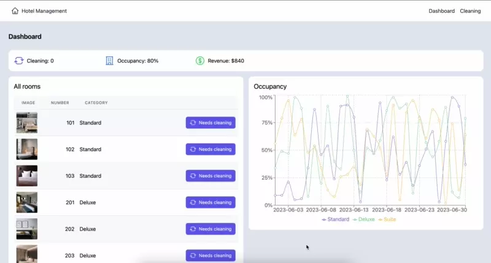

# Hotel Management Dashboard



This is a quick implementation for the requirements in the hotel management dashboard challenge. I tried my best to cover all in the time I can have but there are more to improve. I took notes for a few of them which you can find below as well.

You can see it the implementation in the demo, live on https://hotel-management-challenge.netlify.app/ or built locally with the initial instructions.

```
- Run `npm install` to install the dependencies.
- Run `npm run dev` to start the development server.
- Go to `http://localhost:5173` to view the application and the sample data.
```

### Brainstorming


First I tried to get an initial understanding of the dashboard design for hotel management needs. This could be the inspiration and starting point for better UI/UX improvements.

### Code structure

```
src/
├─ components/
│  ├─ UI/
│  │  ├─ Card.tsx
│  ├─ Header.tsx
│  ├─ index.ts
├─ context/
├─ data/
├─ hooks/
│  ├─ useAppContext.tsx
├─ layouts/
│  ├─ MainLayout.tsx
├─ pages/
│  ├─ Dashboard/
│  │  ├─ components/
│  │  ├─ hooks/
│  │  │  ├─ useDashboard.ts
│  │  ├─ Dashboard.tsx
│  ├─ Cleaning/
├─ utils/
router.ts
types.ts
```

This is the high level code structure. I like keeping things encapsulated as much as possible, therefore having custom hooks help me to organize the code in a good way. 

For ex, `Dashboard.tsx` is responsible for the view and organizing the components, for whatever I need logically or as formatted data, I abstract it to its `useDashbord.ts` hook and call the data/functions I need from this hook. It keeps everything separated meaningfully and easy to read hopefully.

Also pages can have their own components, if it is only used in this page I tried to keep it inside the page, only move it to global components if a reusable need arises. For ex, it happened with `RoomsTable` since two places use it already.

Creating `Layouts` is a great way to keep the page designs consistent in the whole dashboard flow.

These are the key points I can think of at the moment.


### Possible improvement areas

These are the notes for some improvement point that I've taken along the way of building the dashboard. 

- Absolute import config for cleaner import statements
- Create a DataTable, and LineGraph reusable components getting data directly in props for consistency in future uses
- Add pagination to the table data for smooth loading experience
- Better UX/UI and performance improvements in general for the dashboard needs
- Thumbnail images for faster loads
- Permanent storage can be applied
- Add modal confirmation for removing
- Better navigation with sidebar menu
- Add tests
...

Since there is no limit for improving, there can be many addition/refactoring that could bring better user experience and performance.

Thank you.

Best,

Ebru
